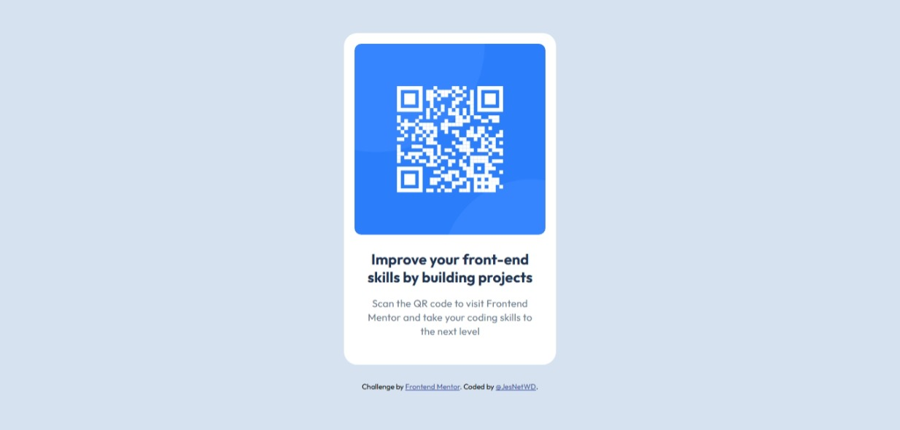

# Frontend Mentor - QR code component solution

This is a solution to the [QR code component challenge on Frontend Mentor](https://www.frontendmentor.io/challenges/qr-code-component-iux_sIO_H). Frontend Mentor challenges help you improve your coding skills by building realistic projects.

## Table of contents

- [Overview](#overview)
  - [Screenshot](#screenshot)
  - [Links](#links)
- [My process](#my-process)
  - [Built with](#built-with)
  - [What I learned](#what-i-learned)
  - [Continued development](#continued-development)
- [Author](#author)

## Overview

### Screenshot



### Links

- Solution URL: [View solutiion here](https://www.frontendmentor.io/solutions/responsive-qr-code-component-using-flexbox-3bs6_pc8hg)
- Live Site URL: [View live site here](https://jesnetwd.github.io/Frontend-Mentor-QR-code-component/)

## My process

### Built with

- Semantic HTML5 markup
- CSS custom properties

### What I learned

I also learnt about keeping my styles simple while making my webpage attractive. I learnt how to vertically align sections of my page using flexbox.

```html
<main>
      

      <section>
        <h1>Improve your front-end skills by building projects</h1>
        <p>
          Scan the QR code to visit Frontend Mentor and take your coding skills
          to the next level
        </p>
      </section>
    </main>

    <footer>
      <div class="attribution">
        Challenge by
        <a href="https://www.frontendmentor.io?ref=challenge" target="_blank"
          >Frontend Mentor</a
        >. Coded by <a href="#">Your Name Here</a>.
    </footer>
```

```css
html,
body {
  height: 100%;
  min-height: 100vh;
}

body {
  margin: 0;
  background-color: #d6e2f0;
  display: flex;
  flex-direction: column;
  justify-content: center;
  align-items: center;
  text-align: center;
  font-family: Outfit, sans-serif;
}
```

### Continued development

I would like to make more simple and attractive styles as well as better layout choices. I would like to design my webpages better.

## Author

- LinkedIn - [Jessica Nwoye](www.linkedin.com/in/jessica-nwoye-45330b311)
- Frontend Mentor - [@JesNetWD](https://www.frontendmentor.io/profile/JesNetWd)
